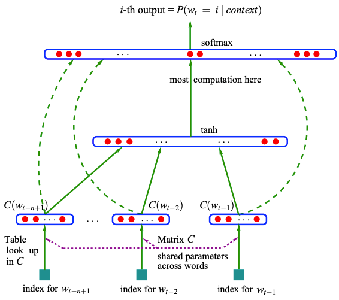

# Character Level Language Model using MLP

## Project Overview

This project implements a character-level language model using a Multilayer Perceptron (MLP). It features:

- **Batch Normalization**: Stabilizes training by normalizing inputs for each mini-batch.
- **Learning Rate Scheduling**: Adjusts the learning rate during training to enhance convergence.

## Batch Normalization

Batch Normalization is applied using the formula:

$$\hat{x}^{(k)} = \frac{x^{(k)} - \mu^{(k)}}{\sqrt{\sigma^{(k)2} + \epsilon}}$$

Where:
- $\hat{x}^{(k)}$: Normalized value
- $x^{(k)}$: Input value
- $\mu^{(k)}$: Mean of the mini-batch
- $\sigma^{(k)}$: Standard deviation of the mini-batch
- $\epsilon$: Small constant for numerical stability

The normalized values are then scaled and shifted using learnable parameters:
- $\gamma$: Scale
- $\beta$: Shift

## Learning Rate Scheduling

The learning rate is dynamically adjusted to improve model convergence during training.

## Model Architecture

